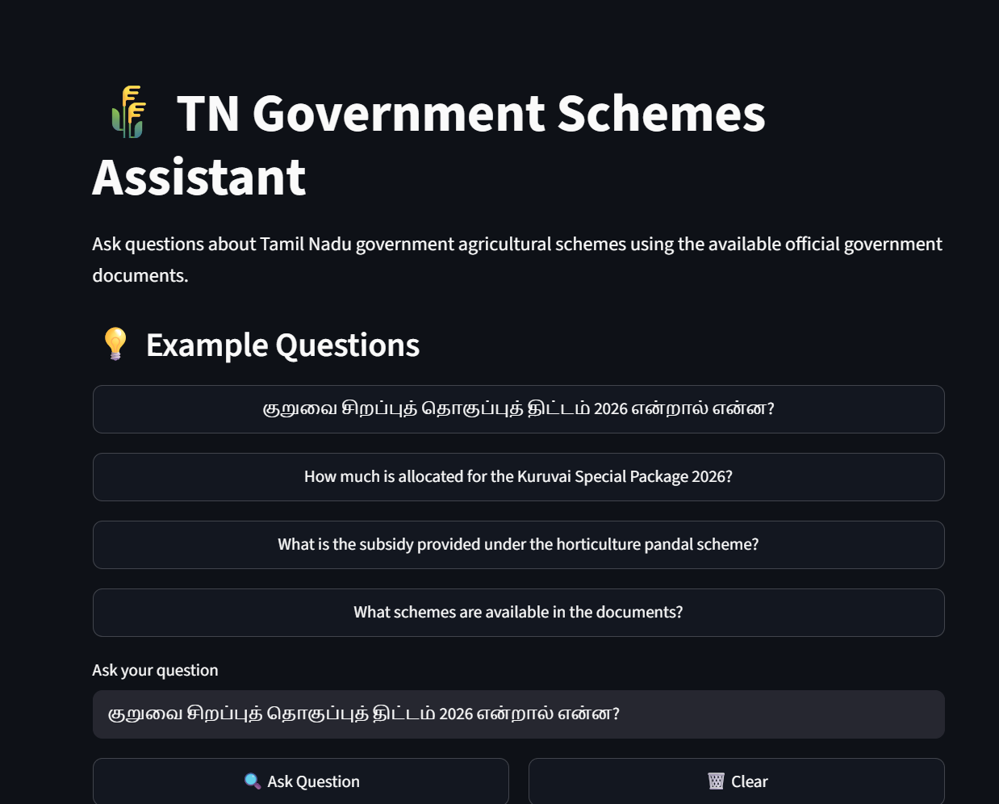
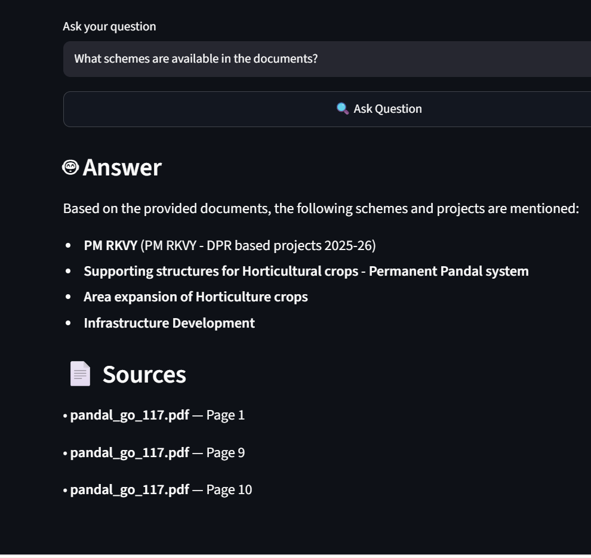
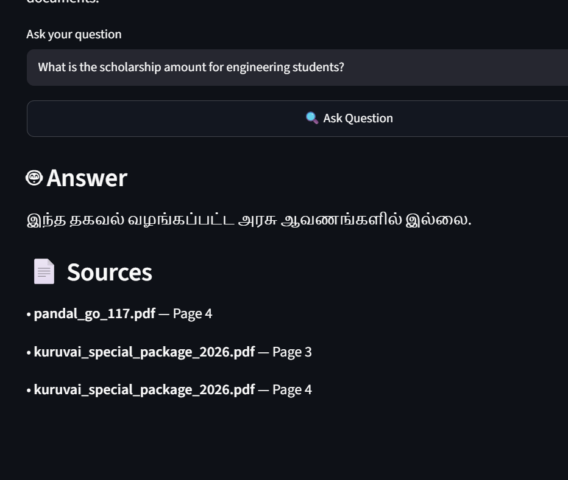

# 🌾 TN Government Schemes RAG Assistant

A Retrieval-Augmented Generation (RAG) application that helps users find information about Tamil Nadu government agricultural schemes from official government documents.

The application supports questions in **English and Tamil** and provides **context-grounded answers with source and page references**.

## 🚀 Live Demo

**TN Government Schemes Assistant:** [YOUR_STREAMLIT_APP_URL](https://tn-schemes-assistant.streamlit.app/)

Built with **Streamlit**.

## 📌 Problem

Government agricultural scheme information is often available in lengthy Government Orders and official documents.

Finding information such as:

- Subsidy amounts
- Financial allocations
- Scheme benefits
- Eligibility
- Implementation details

can be time-consuming.

This project provides a simple conversational interface to retrieve relevant information from government documents.

## 💡 Solution

The application uses a **Retrieval-Augmented Generation (RAG)** pipeline:

```text
Government PDFs
      ↓
PDF Text Extraction
      ↓
Text Chunking
      ↓
Gemini Embeddings
      ↓
Qdrant Vector Database
      ↓
User Question
      ↓
Semantic Search
      ↓
Relevant Context
      ↓
Gemini 3.6 Flash
      ↓
Grounded Answer
      ↓
Source + Page Number

✨ Features
📄 Government PDF document processing
🔎 Semantic similarity search
🧠 Retrieval-Augmented Generation
🌐 English and Tamil question support
📚 Source document and page references
🛡️ Context-grounded responses
🚫 Refusal when information is unavailable in the documents
☁️ Qdrant vector database
🎨 Streamlit web interface
📚 Knowledge Base
Kuruvai Special Package 2026

The knowledge base includes information about:

Financial allocation
Delta and non-delta areas
Paddy cultivation incentives
Kuruvai, Kar and Sornavari seasons
Permanent Pandal Scheme

The knowledge base includes information about:

Subsidy details
Supporting structures
GI wires
Planting material and labour
SC/ST assistance
Eligibility and implementation conditions
🛠️ Tech Stack
Technology	Purpose
Python	Application development
LangChain	RAG pipeline
Gemini	Embeddings and LLM
Qdrant	Vector database
PyPDF	PDF text extraction
Streamlit	Web interface
🔍 Example Questions
English
How much is allocated for the Kuruvai Special Package 2026?

What is the subsidy under the Permanent Pandal scheme?

What schemes are available in the documents?
Tamil
குறுவை சிறப்புத் தொகுப்புத் திட்டம் 2026 என்றால் என்ன?
🛡️ Grounded Answering

The application instructs the LLM to:

Use only the retrieved government-document context
Avoid unsupported assumptions
Avoid inventing scheme details
Respond in the language of the user's question
Refuse when the requested information is not available

Example refusal:

இந்த தகவல் வழங்கப்பட்ட அரசு ஆவணங்களில் இல்லை.
📊 Evaluation

A prototype retrieval evaluation was performed using 15 test questions.

Metric	Result
Test questions	15
Expected sources retrieved	15
Source retrieval rate	100%

This measures source retrieval performance, not end-to-end answer accuracy.

🖥️ Screenshots
### Application Interface



### RAG Answer with Sources



### Grounded Refusal


RAG Answer with Sources

Grounded Refusal

📁 Project Structure
tn-schemes-rag/
│
├── data/
│   ├── kuruvai_special_package_2026.pdf
│   └── pandal_go_117.pdf
│
├── screenshots/
│   ├── 01-home.png
│   ├── 02-rag-answer.png
│   └── 03-grounded-refusal.png
│
├── src/
│   ├── ingest.py
│   ├── rag.py
│   ├── app.py
│   ├── evaluation.py
│   └── answer_evaluation.py
│
├── .gitignore
├── requirements.txt
└── README.md

⚙️ Setup
1. Clone the repository
git clone YOUR_GITHUB_REPOSITORY_URL
cd tn-schemes-rag
2. Create a virtual environment
python -m venv venv

Activate it on Windows:

venv\Scripts\activate
3. Install dependencies
pip install -r requirements.txt
4. Configure API keys

Create a .env file:

GOOGLE_API_KEY=your_google_api_key
QDRANT_URL=your_qdrant_url
QDRANT_API_KEY=your_qdrant_api_key

Never upload .env to GitHub.

5. Ingest documents
python src\ingest.py
6. Run the application
streamlit run src\app.py
🔐 Security

API keys are stored using environment variables and Streamlit secrets.

The following files are excluded from Git:

.env
__pycache__/
*.pyc

Never expose API keys in:

GitHub
Screenshots
Demo videos
README files
🚀 Future Improvements
Add more official government documents
Add OCR support for scanned PDFs
Improve Tamil-English retrieval
Add hybrid search
Improve answer evaluation
Add FastAPI backend
Implement Agentic RAG
🎯 What I Learned

Through this project, I gained hands-on experience with:

Retrieval-Augmented Generation
Embeddings
Vector databases
Semantic search
LangChain
Gemini APIs
Prompt engineering
PDF document processing
Streamlit
RAG evaluation
👩‍💻 Author

Ramya

Generative AI / AI Engineering Enthusiast